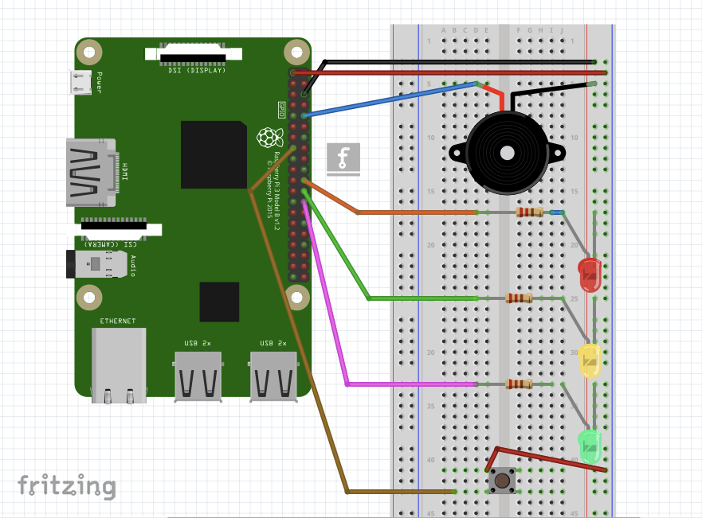

## Making traffic lights

For this worksheet you'll need a breadboard, three LEDs, a button, a buzzer, and the necessary jumper cables and resistors. You can purchase these individually, or get everything you need in the [CamJam EduKit](https://thepihut.com/products/camjam-edukit).

### Wiring

To get started, you'll need to place all the components on the breadboard and connect them to the appropriate GPIO pins on the Raspberry Pi.

+ First, you need to understand how each component is connected:

    - A push button requires 1 ground pin and 1 GPIO pin
    - An LED requires 1 ground pin and 1 GPIO pin, with a current limiting resistor
    - A buzzer requires 1 ground pin and 1 GPIO pin

    Each component requires its own individual GPIO pin, but components can share a ground pin. We will use the breadboard to enable this.

+ Place the components on the breadboard and connect them to the Raspberry Pi GPIO pins, according to the following diagram:

    

    Note that the row along the long side of the breadboard is connected to a ground pin on the Raspberry Pi, so all the components in that row (which is used as a ground rail) are hence connected to ground.

+ Observe the following table, showing which GPIO pin each component is connected to:

| Component | GPIO pin |
| --------- | :------: |
| Button    | 21       |
| Red LED   | 25       |
| Amber LED | 8        |
| Green LED | 7        |
| Buzzer    | 15       |

### Dive into Rust

Open the Python application IDLE and get started by testing out the button.

+ Open  the `examples/trafficlights.rs` and enter the following code:

    ```rust
    extern crate rust_gpiozero;
    use rust_gpiozero::*;

    fn main() {

    // Create a button which is attached to Pin 22
    let button = Button::new(22);

    loop{
        println!("{}",button.is_active());

        }
    }
    ```

+ Run the program using the command:

    ```bash
    cargo run --example trafficlights
    ```

+ This will constantly print `false`. When you press the button this will switch to `true`, and when you let go it will return to `false`.

    `button.is_active()` is a method of the `button` instance, which provides the state of the button (pressed or not) at any given time.

+ Now edit the code again and modify your `loop` to the following:

    ```rust
    loop{
        if(button.is_active()){
            println!("Hello");      
        }        
        else{
            println!("Goodbye");
        }
    }
    ```

+ Run the code again and you'll see "Hello" printed when the button is pressed, and "Goodbye" when the button is not pressed.

+ Modify the loop again:

    ```rust
    loop{
        button.wait_for_press();
        println!("Pressed");
        button.wait_for_release();
        println!("Released");
    }
    ```

+ When you run the code this time, nothing will happen until you press the button, when you'll see "Pressed", then when you let go you'll see "Released". This will occur each time the button is pressed, but rather than continuously printing one or the other, it only does it once per press.

### Add an LED

Now you'll add an LED into the code and use GPIO Zero to allow the button to determine when the LED is lit.

+ Add a line below `let button = Button::new(22);` to create an instance of an `LED`:

    ```rust
    let mut led = LED::new(25);
    ```

+ Now modify your `loop` to turn the LED on when the button is pressed:

    ```rust
    loop{
        button.wait_for_press();
        led.on();
        button.wait_for_release();
        led.off();
    }
    ```

+ Run your code and the LED will come on when you press the button. Hold the button down to keep the LED lit.

+ Now swap the `on` and `off` lines to reverse the logic:

    ```rust
    loop{
        led.on();
        button.wait_for_press();
        led.off();
        button.wait_for_release(); 
    }
    ```

+ Run the code and you'll see the LED stays on until the button is pressed.


### Traffic lights

You have three LEDs: red, amber, and green. Perfect for traffic lights! 

+ Replace your `let mut led = LED::new(25);` line with the following:

    ```rust
    let mut red = LED::new(25);
    let mut amber = LED::new(8);
    let mut green = LED::new(7);
    ```

    The are three GPIO pin numbers: red, amber, and green (in that order).

+ Now amend your `loop` to control the `LEDs`:

    ```rust
    loop{
        button.wait_for_press();
        // Switch LEDs on
        red.on();
        amber.on();
        green.on();
        button.wait_for_release();
        // Switch LEDs off
        red.off();
        amber.off();
        green.off();
    }
    ```

### Add a buzzer

Now you'll add your buzzer to make some noise.

+ Add a line below your creation of `button` and `red`, `amber` and `green` to add a `Buzzer`:

    ```rust
    let mut buzzer = Buzzer::new(15);    
    ```

+ `Buzzer` works exactly like `LED`, so try adding a `buzzer.on();` and `buzzer.off();` into your loop:

    ```rust
    loop{
        button.wait_for_press();
        // Switch LEDs on
        red.on();
        amber.on();
        green.on();
        // Switch Buzzer on
        buzzer.on();
        button.wait_for_release();
        // Switch LEDs off
        red.off();
        amber.off();
        green.off();
        // Switch Buzzer off
        buzzer.off();
    }
    ```

### Traffic lights sequence

With traffic light LEDs, a button and a buzzer, you can create your own traffic lights sequence, complete with pedestrian crossing!

+ At the top, add the following:

    ```rust
        use std::thread::sleep;
        use std::time::Duration;
    ```

+ Modify your loop to perform an automated sequence of LEDs being lit:

    ```rust
    loop{
        green.on();
        sleep(Duration::from_secs(1));
        amber.on();
        sleep(Duration::from_secs(1));
        red.on();
        sleep(Duration::from_secs(1));
        green.off();
        amber.off();
        red.off();
    }        
    ```

+ Add a `wait_for_press` so that pressing the button initiates the sequence:

    ```rust
    loop{
        button.wait_for_press();
        green.on();
        sleep(Duration::from_secs(1));
        amber.on();
        sleep(Duration::from_secs(1));
        red.on();
        sleep(Duration::from_secs(1));
        green.off();
        amber.off();
        red.off();
    }        
    ```

    Try some more sequences of your own.

+ Now try creating the full traffic lights sequence:

    - Green on
    - Amber on
    - Red on
    - Red and amber on
    - Green on

    Be sure to turn the correct lights on and off at the right time, and make sure you use `sleep` to time the sequence perfectly.

+ Try adding the button for a pedestrian crossing. The button should move the lights to red (not immediately), and give the pedestrians time to cross before moving back to green until the button is pressed again.

+ Now try adding a buzzer to beep quickly to indicate that it is safe to cross, for the benefit of visually impaired pedestrians.


<!-- + Now replace `led.on();` with `led.blink(1,1);`:

    ```rust
    loop{
        led.blink(1,1);
        button.wait_for_press();
        led.off();
        button.wait_for_release(); 
    }
    ```

+ Run the code and you'll see the LED blink on and off until the button is pressed, at which point it will turn off completely. When the button is released, it will start blinking again.

+ Try changing the parameters in `blink` to make it blink faster or slower:

    - `led.blink(2, 2)` - 2 seconds on, 2 seconds off
    - `led.blink(0.5, 0.5)` - half a second on, half a second off
    - `led.blink(0.1, 0.2)` - one tenth of a second on, one fifth of a second off

    `blink`'s first two parameters are `on_time` and `off_time`.
 -->