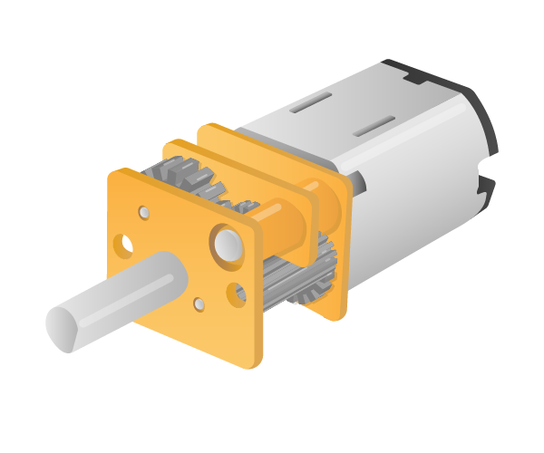
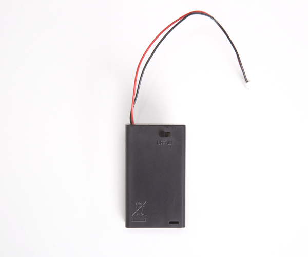

## What you will need

### Hardware

You will need a Raspberry Pi with an SD card and the usual peripherals. You will also need the following components for partilular steps:

- Step 4: 1x LED, Female-to-female jumper leads, 1x 330Ω Resistor

- Step 5: 1x LED, Female-to-female jumper leads, 1x 330Ω Resistor

- Step 6: 1x LED, Female-to-female jumper leads, 1x 330Ω Resistor

- Step 7: 1x Tactile button, Male-to-female jumper leads, 1x Solderless breadboard

- Step 8: 1x LED, Female-to-female jumper leads, 1x 330Ω Resistor, 1x Tactile button, Male-to-female jumper leads

- Step 9: 1x Tactile button, Male-to-female jumper leads

- Step 10: 1x Buzzer, Male-to-female jumper leads, 1x Solderless breadboard

- Step 11: 3x LEDs, 3x 330Ω Resistors, Buzzer, Male-to-female jumper leads, 1x Tactile button, 1x Solderless breadboard

> Here is a complete list of components required for _Physical Computing with Python_

 |1x Solderless breadboard | Male-to-female jumper leads | Female-to-female jumper leads | Male-to-male jumper leads |
|:--------:|:-------:|:--------:|:--------:|
|  |  |  |  |

| 1x Tactile button | 3x LEDs | Ultrasonic distance sensor| Passive infrared motion sensor |
|:--------:|:-------:|:--------:|:--------:|
|  |  |  |  |

| Light Dependent Resistor | 2x 5V Micro Metal Gearmotor | 3x 330Ω Resistor| 470Ω Resistor |
|:--------:|:-------:|:--------:|:--------:|
|  |  |  |  |

| 1x 1μF Capacitor | Buzzer | Motor Controller | Battery Pack |
|:--------:|:-------:|:--------:|:--------:|
|  |  |  |  |

Images source: [Raspberry Pi Foundation](https://www.raspberrypi.org/)
### Software

You will need to install Rust on your Raspbery Pi.

Follow the steps [here](https://doc.rust-lang.org/book/second-edition/ch01-01-installation.html#installing-rustup-on-linux-or-mac).
