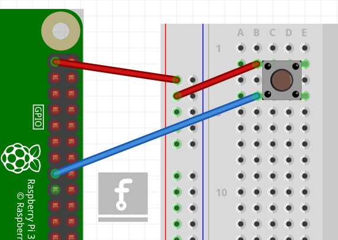

## Using buttons to get input

Now you're able to control an output component (an LED), let's connect and control an input component: a button.

+ Connect a button to another GND pin and GPIO pin 22, like this:

    


+ This time you'll need the `Button` component, and to tell it that the button is on pin 22. Edit the `examples/button.rs` file and write the following code in your new file:

```rust
extern crate rust_gpiozero;
use rust_gpiozero::*;

fn main() {
    // Create a button which is attached to Pin 22
    let button = Button::new(22);
}
```

+ Now you can get your program to do something when the button is pushed. Add these lines:

```rust
button.wait_for_press();
println!("button pressed");
```

<!-- todo: Add full script here -->

+ Save the file and run the code with: 

```bash
cargo run --example button
```

+ Press the button and your text will appear.
